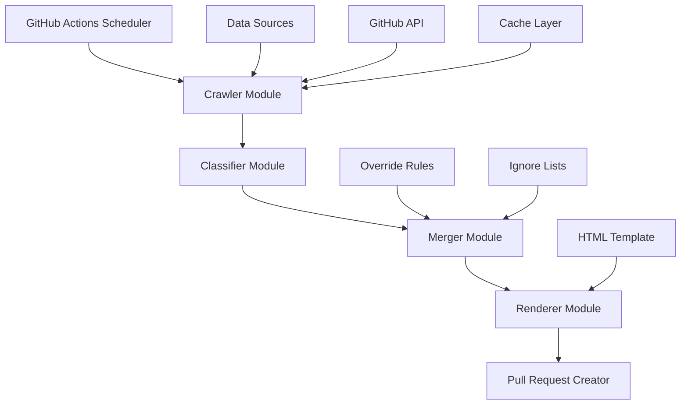

# Design Document

## Overview

Le Ghost is an automated curation system that transforms the manual process of maintaining a Ghost CMS themes directory into a robust, GitHub-native pipeline. The system discovers, classifies, and curates Ghost themes automatically while preserving human editorial control through override mechanisms.

The architecture follows a data-driven approach where YAML files serve as the source of truth, TypeScript modules handle processing logic, and GitHub Actions orchestrate the automation. The system generates a static HTML directory from templates, ensuring fast loading and easy deployment.

## Architecture

The system follows a modular pipeline architecture with clear separation of concerns:



### Core Components

1. **Data Layer**: YAML files storing canonical data, overrides, and configuration
2. **Processing Pipeline**: TypeScript modules for crawling, classification, and rendering
3. **Automation Layer**: GitHub Actions workflow for scheduling and PR creation
4. **Template System**: HTML template with placeholder substitution
5. **Caching System**: Persistent cache for API responses and intermediate results

## Components and Interfaces

### Data Schema

```typescript
interface GhostItem {
  id: string;                    // "owner/repo"
  name: string;                  // Display name
  repo: string;                  // "owner/repo"
  url: string;                   // GitHub URL
  description: string | null;    // Repository description
  category: string;              // "Theme" | "Tool" | "Starter" | "Official"
  tags: string[];               // ["ghost-theme", "handlebars", "responsive"]
  stars: number;                // GitHub stars count
  pushedAt: string;             // ISO date string
  archived: boolean;            // Repository archived status
  fork: boolean;                // Is fork
  license: string | null;       // License identifier
  topics: string[];             // GitHub topics
  score: number;                // Classification score (0-100)
  confidence: "high" | "medium" | "low";
  notes: string | null;         // Curator notes
  hidden: boolean;              // Hide from HTML output
}

interface Override {
  repo: string;                 // "owner/repo"
  name?: string;               // Override display name
  category?: string;           // Override category
  tags_add?: string[];         // Additional tags
  tags_remove?: string[];      // Tags to remove
  notes?: string;              // Custom notes
  hidden?: boolean;            // Hide item
}

interface IgnoreRule {
  repos: string[];             // Exact repo matches
  patterns: string[];          // Regex patterns
}

interface SearchQuery {
  query: string;               // GitHub search query
  maxResults: number;          // Results limit
  minStars: number;           // Minimum stars filter
}
```

### Module Interfaces

```typescript
// crawl.ts
interface CrawlerConfig {
  queries: SearchQuery[];
  rateLimit: {
    requestsPerHour: number;
    backoffMultiplier: number;
  };
  cache: {
    ttl: number;
    directory: string;
  };
}

interface CrawlResult {
  repositories: RepositoryData[];
  apiCallsUsed: number;
  cacheHits: number;
  errors: string[];
}

// classify.ts
interface ClassificationResult {
  score: number;
  confidence: "high" | "medium" | "low";
  signals: {
    topics: number;
    readme: number;
    structure: number;
    penalties: number;
  };
  reasoning: string[];
}

// merge.ts
interface MergeResult {
  items: GhostItem[];
  stats: {
    added: number;
    updated: number;
    removed: number;
    ignored: number;
  };
  changes: ChangeRecord[];
}

// render.ts
interface RenderContext {
  items: GhostItem[];
  categories: CategoryGroup[];
  metadata: {
    lastUpdate: string;
    totalItems: number;
    dataSource: string;
  };
}
```

## Data Models

### File Structure

```
data/
├── items.yml           # Canonical item list
├── overrides.yml       # Manual overrides
├── ignore.yml          # Blacklist rules
└── sources.yml         # Search configuration

scripts/
├── crawl.ts           # GitHub discovery
├── classify.ts        # Theme classification
├── merge.ts           # Data merging
├── render.ts          # HTML generation
└── update.ts          # Pipeline orchestrator

templates/
└── index.template.html # HTML template

.github/workflows/
└── update.yml         # Automation workflow
```

### Data Flow

1. **Discovery Phase**: Crawler queries GitHub API using configured search terms
2. **Enrichment Phase**: Collect detailed metadata for candidate repositories
3. **Classification Phase**: Apply heuristics to determine theme relevance
4. **Merging Phase**: Combine new data with existing items, apply overrides and ignores
5. **Rendering Phase**: Generate HTML from template and final dataset
6. **Automation Phase**: Create pull request with changes and summary

## Correctness Properties

*A property is a characteristic or behavior that should hold true across all valid executions of a system-essentially, a formal statement about what the system should do. Properties serve as the bridge between human-readable specifications and machine-verifiable correctness guarantees.*

### Property Reflection

After analyzing all acceptance criteria, several properties can be consolidated to eliminate redundancy:

- Override and ignore properties can be combined into comprehensive data precedence properties
- Classification properties can be unified into a single scoring property
- Caching and API efficiency properties can be merged into performance properties
- Data validation properties can be consolidated into schema compliance properties

### Core Properties

**Property 1: Data Precedence and Integrity**
*For any* repository and override/ignore configuration, manual curation rules should always take precedence over automated classification, and ignored repositories should never appear in final output regardless of their scores
**Validates: Requirements 1.2, 1.3, 4.1, 4.4, 4.5**

**Property 2: YAML Schema Consistency**
*For any* YAML data file in the system, the content should conform to its defined schema and maintain structural integrity across all operations
**Validates: Requirements 1.1, 1.5, 9.1**

**Property 3: GitHub API Efficiency**
*For any* crawler execution, the system should respect rate limits, use caching to minimize API calls, and handle pagination correctly without exceeding GitHub's usage policies
**Validates: Requirements 2.3, 2.4, 6.5, 8.1, 8.2**

**Property 4: Classification Accuracy**
*For any* repository, the classification score should reflect the presence of Ghost theme indicators (topics, README content, file structure) and properly exclude archived or non-theme repositories
**Validates: Requirements 3.1, 3.2, 3.3, 3.4, 3.5**

**Property 5: Template Rendering Consistency**
*For any* valid dataset and template, the renderer should produce well-formed HTML that includes all required metadata, proper categorization, and maintains responsive design
**Validates: Requirements 5.1, 5.2, 5.3, 5.4, 5.5**

**Property 6: Configuration Flexibility**
*For any* configuration change in YAML files, the system should validate the new settings, apply them correctly, and maintain backward compatibility with existing data
**Validates: Requirements 10.1, 10.2, 10.3, 10.4**

**Property 7: Error Handling and Validation**
*For any* invalid input or network failure, the system should provide clear error messages, implement appropriate retry logic, and maintain data integrity
**Validates: Requirements 7.5, 8.3, 9.2, 9.3, 9.4**

**Property 8: Cross-Environment Consistency**
*For any* identical input data and configuration, local execution and GitHub Actions should produce the same output files and behavior
**Validates: Requirements 7.2, 7.3**

**Property 9: Pull Request Generation**
*For any* detected changes in the dataset, the system should create a pull request with accurate change summaries and proper formatting
**Validates: Requirements 6.2, 6.3, 9.5**

**Property 10: Metadata Completeness**
*For any* discovered repository, all required metadata fields (stars, pushedAt, topics, license) should be populated or explicitly marked as null
**Validates: Requirements 2.2, 2.5**

<function_calls>
<invoke name="prework">
<parameter name="featureName">le-ghost
## Error Handling

The system implements comprehensive error handling across all modules:

### API Error Handling
- **Rate Limiting**: Exponential backoff with jitter for GitHub API rate limits
- **Network Failures**: Retry logic with circuit breaker pattern
- **Authentication**: Clear error messages for token issues
- **Quota Exhaustion**: Graceful degradation and scheduling for next available window

### Data Validation Errors
- **Schema Validation**: Detailed error messages with line numbers for YAML issues
- **Duplicate Detection**: Automatic resolution with conflict reporting
- **URL Validation**: HTTP status checking with fallback mechanisms
- **Encoding Issues**: UTF-8 validation and sanitization

### Processing Errors
- **Classification Failures**: Fallback to basic heuristics with confidence penalties
- **Template Rendering**: Validation of output HTML with error recovery
- **File System**: Atomic operations with rollback capabilities
- **Concurrency**: Lock-free operations with conflict resolution

## Testing Strategy

The system employs a dual testing approach combining unit tests for specific functionality and property-based tests for comprehensive validation:

### Unit Testing
- **Module Isolation**: Each TypeScript module has dedicated unit tests
- **Mock Dependencies**: GitHub API responses and file system operations
- **Edge Cases**: Boundary conditions and error scenarios
- **Integration Points**: Interface contracts between modules

### Property-Based Testing
- **Data Integrity**: Verify YAML round-trip consistency and schema compliance
- **Classification Logic**: Test scoring algorithms across diverse repository samples
- **Template Rendering**: Validate HTML output structure and content accuracy
- **API Efficiency**: Monitor rate limit compliance and caching effectiveness

### Test Configuration
- **Minimum 100 iterations** per property test to ensure statistical confidence
- **Randomized inputs** for repository metadata, override rules, and configuration
- **Deterministic outputs** for identical inputs across test runs
- **Performance benchmarks** for API usage and processing time

Each property test references its corresponding design property using the format:
**Feature: le-ghost, Property {number}: {property_text}**

### Continuous Integration
- **Pre-commit hooks** for linting and basic validation
- **Pull request checks** running full test suite
- **Integration testing** with actual GitHub API (rate-limited)
- **Performance regression** detection for large datasets